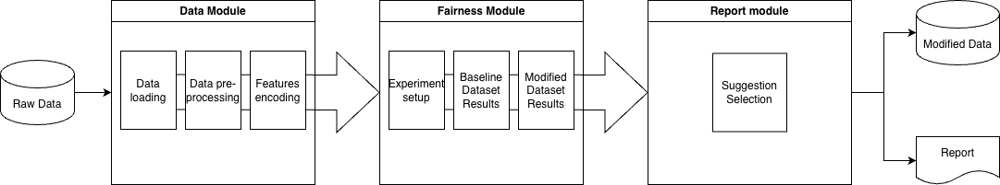

# FairPath: Toolkit for Tabular Datasets

A professional command-line interface (CLI) tool for auditing algorithmic bias, applying mitigation strategies, and generating comprehensive fairness reports.

## 🏗 Architecture Overview



- **Data Module:** Handles structural integrity, cleaning, and encoding.
- **Fairness Module:** Orchestrates experiments (Baseline vs. Mitigated).
- **Report Module:** Generates visualizations and decision-support outputs.

## 🚀 Setup

1.  **Install Dependencies:**
    Ensure you have Python 3.8+ installed. It is recommended to use a virtual environment. You can install the package and its dependencies in editable mode:

    ```bash
    pip install -e .
    ```

    Alternatively, to install development dependencies:
    ```bash
    pip install -e ".[dev]"
    ```

2.  **Run the Application:**
    Once installed, you can run the tool directly using the entry point:
    ```bash
    fairpath
    ```
    Or manually via python:
    ```bash
    python fairpath/main.py
    ```

## 📖 Core Concepts

### Fairness Definitions
- **Demographic Parity:** Ensures the positive outcome is predicted at equal rates across groups.
- **Equalized Odds:** Ensures equal True Positive Rates (TPR) and False Positive Rates (FPR) across groups.

### Mitigation Strategies
- **Resampling:** Balances the dataset by over/undersampling subgroups to equalize base rates.
- **Relabeling:** Flips labels of individuals near the decision boundary to achieve parity with minimal utility loss.
- **Synthetic (SMOTE/CDA):** Generates new samples (SMOTE) or counterfactuals (CDA) to force model invariance to sensitive attributes.

## 🛠 Developer Guide

### Project Structure
- `fairpath/core/`: Domain services and DTOs (Data Transfer Objects).
- `fairpath/fairness/`: Core logic for metrics and mitigation algorithms.
- `fairpath/reporting/`: PDF generation and visualization logic.
- `fairpath/data/`: Low-level loading and validation utilities.

### Adding New Mitigation Strategies
1. Define a new class in `fairpath/fairness/mitigation.py`.
2. Inherit from the `MitigationStrategy` interface.
3. Register the method in the UI or Benchmark engine as needed.

## 📋 Methodology

The toolkit employs a **Pre-processing Mitigation** approach. It targets bias in the training data distribution before the model is trained.

1.  **Audit Phase:** Computes metrics on the original data split (stratified by target and sensitive attribute).
2.  **Mitigation Phase:** Applies the selected transformation (e.g., Relabeling).
3.  **Validation Phase:** Evaluates the new model on the **original** (untouched) test set to ensure fairness generalizes to real-world data.

## ⚠️ Fairness Caveats

While pre-processing mitigation is a powerful tool for improving algorithmic equity, users should be aware of the following:

*   **Proxy Bias:** Removing a sensitive attribute (e.g., Race) does not guarantee fairness if other features act as strong proxies (e.g., Zip Code). FairPath encourages auditing with multiple related attributes.
*   **Trade-offs:** Improving fairness often results in a slight decrease in overall predictive accuracy. This "Fairness-Utility Trade-off" is explicitly analyzed in the generated reports.
*   **Representativeness:** Mitigation strategies like Resampling or Synthetic generation depend on the quality of the original minority group samples. If the original data is too sparse, synthetic samples may not reflect real-world distributions.
*   **Contextual Necessity:** Fairness is not just a numeric metric. Users should interpret results within the specific legal and social context of their application.

## 📊 Directory Structure

*   `fairpath/`: Source code.
*   `outputs/`: Generated reports, plots, and datasets (configured in `ReportingService`).
*   `fairpath/config/`: Default configurations and thresholds.
